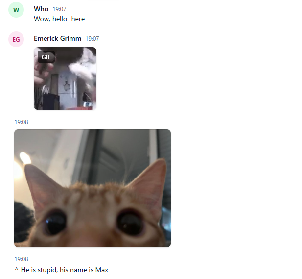
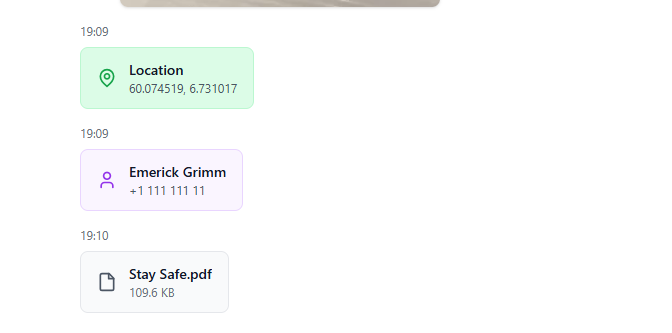
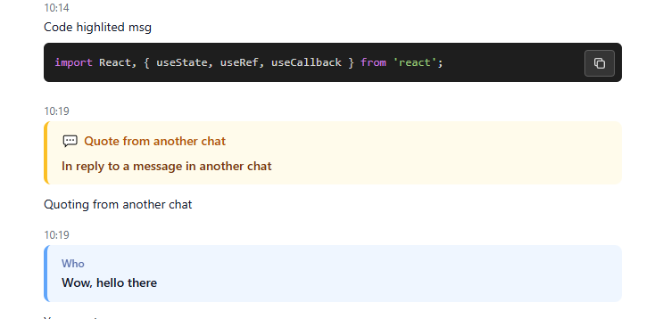
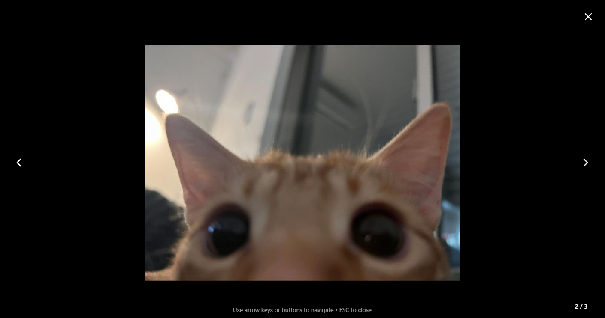
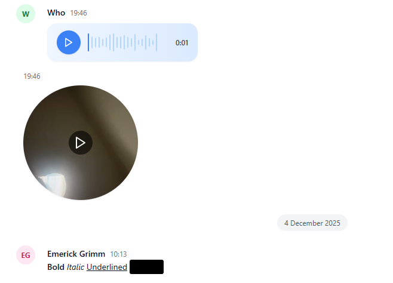

# Telegram Chat Viewer

A lightweight React app to view Telegram HTML exports locally, with rich formatting, media browsing, and a Telegram-like UI.



*Browse your exported Telegram chats with a familiar interface*

## Features

- **Rich Message Rendering**: Renders Telegram message exports (`messages.html` / `messages1.html`) with full formatting support (bold, italic, code blocks, spoilers, blockquotes)
- **Comprehensive Media Handling**: Photos, videos, GIFs, stickers, animations, files, locations, contacts, and voice messages

- **Global Media Viewer**: Fullscreen media browser with keyboard navigation and counter (X / Y)
- **Inline Playback**: Round-video playback and Telegram-style audio waveform for voice messages

- **Quote Preview**: Shows the actual quoted message content when available


- *Navigate through photos and videos with keyboard shortcuts*


- *Play voice messages with the familiar Telegram waveform interface*

## Quick Start

### 1. Install dependencies

```powershell
npm install
```

### 2. Start dev server

```powershell
npm run dev
```

Open the local server URL printed by Vite (usually http://localhost:3000) in your browser.

## How to Use

1. **Export your chat** from Telegram Desktop (Chat -> More -> Export Chat History, Format: HTML -> Export)
2. **Place the exported folder** somewhere accessible on your computer
3. **Open the app** and choose the exported folder (the app reads `messages.html` and associated media files)
4. **Browse your messages** with full formatting and media support
5. **Click media thumbnails** to open the global viewer
6. **Navigate media** using left/right arrow keys or on-screen chevrons
7. **Play voice messages** inline with the Telegram-style waveform UI

## Developer Notes

- Built with **React + Vite**, **Tailwind CSS**, and **highlight.js** for syntax highlighting
- Parser logic is in `src/utils/parser.js` and returns message objects used by the renderer
- If you encounter dev-server errors, try removing `node_modules` and re-running `npm install`

## TODO

- [ ] **Search Feature**: Add ability to search through chat history by message content, sender, or date
- [ ] Enhanced filtering options
- [ ] Dark/light theme toggle

## Contributing

PRs are welcome! Please follow the existing code style and run the dev server locally to test changes before submitting.

## License

[MIT](./LICENSE.MD)

---

**Note**: This viewer runs entirely locally in your browser. No data is uploaded or sent anywhere.